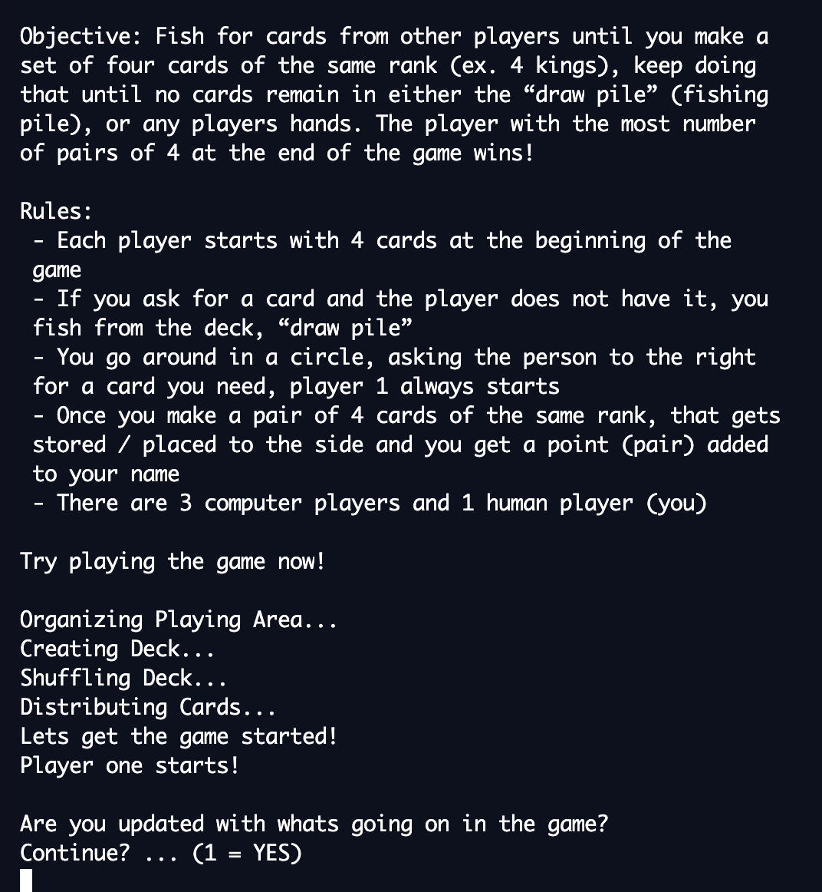

# Getting Started 
* To run the game, just clone repo and open with an IDE or repl.it and run the Main.java file

# Built With 
* Java 

# Description 
>> This is a Java GoFish CardGame played entirely with the console. 

# Project Images 

- #### How the game starts  

    

    
    
- #### Instructions 

    
 

- #### Computer Player Turn 

    
 
   
- #### Human Player Turn 

    
 

# Acknowledgements 
Made By: 
* Divyam Patel 
